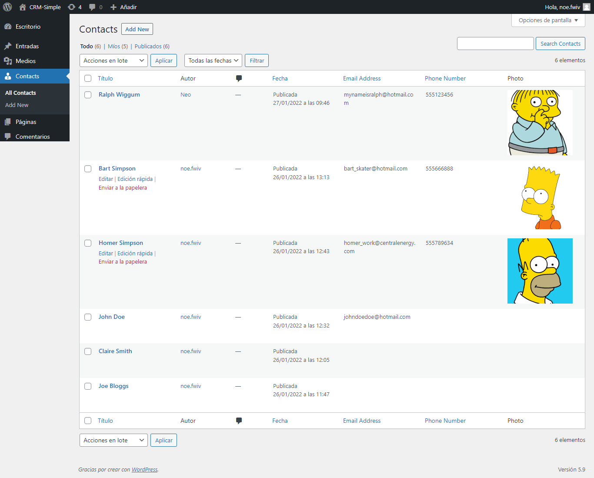
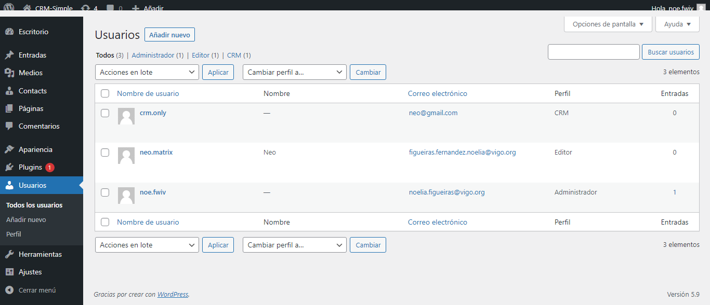

# Hacer un CRM Simple en Wordpress

Siguiendo el tutorial: [link](https://code.tutsplus.com/series/create-a-simple-crm-in-wordpress--cms-641)

Actuamos en la carpeta wp-content/plugins/tuts-crm (última carpeta creada por nosotres)

Primero: creando tipo de entrada personalizada (Contacto). [link](https://code.tutsplus.com/tutorials/create-a-simple-crm-in-wordpress-creating-a-custom-post-type--cms-20014)

Segundo: creando campos personalizados (Email). [link](https://code.tutsplus.com/tutorials/create-a-simple-crm-in-wordpress-creating-custom-fields--cms-20048)

Tercero: campos personalizados avanzados. [link](https://code.tutsplus.com/tutorials/create-a-simple-crm-in-wordpress-advanced-custom-fields--cms-20049)

- Nos quedamos con el código de la primera parte, ya que el de la segunda era para ver el proceso de registrar campos meta personalizados, guardar y recuperar datos
- El código completo de la segunda parte está en codigo_parte2.md

Cuarto: añadiendo columnas a una WP_List_Table (Contacts - campos personalizados) y la posibilidad de filtrar contactos a partir de cualquier columna. [link](https://code.tutsplus.com/tutorials/create-a-simple-crm-in-wordpress-adding-columns-to-wp_list_table--cms-20065)

Quinto: extendiendo la búsqueda en WordPress, para poder buscar por columnas y no solo por título o contenido. [link](https://code.tutsplus.com/tutorials/create-a-simple-crm-in-wordpress-extending-wordpress-search--cms-22953)

Sexto: restringiendo / escondiendo los items del menú de administración. Se crea un usuario con el rol de editor y tiene menos posibilidades de acción dentro del escritorio de WordPress (pero puede crear y editar Contacts). [link](https://code.tutsplus.com/tutorials/create-a-simple-crm-in-wordpress-restricting-hiding-menu-items--cms-22983)

Séptimo: uso de capacidades personalizadas -> a-registrando la capacidad de personalizar en el campo Contacts, b-creando un nuevo rol de usuario de WordPress con solo la capacidad personalizada para Contacts, y c-editando usuarios para asignarlos a ese rol creado. (Sólo hace falta modificar la función de registro y añadir una función al php y con los permisos a los usuarios). [link](https://code.tutsplus.com/tutorials/create-a-simple-crm-in-wordpress-using-custom-capabilities--cms-22985)

Este proyecto es muy completo y explica un montón de funcionalidades y opciones de WordPress, al llegar al final de los artículos hemos obtenido un plugin funcional de un campo personalizado y varios usuarios con distintos permisos para crear y editar Contacts. Aquí se muestran algunos pantallazos del Escritorio en el que hemos estado trabajando:

